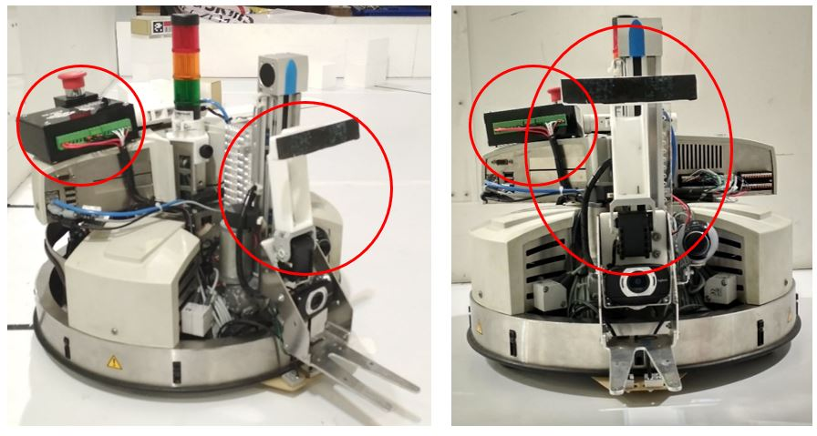

# Holder_and_Controlled_Box_Robotino3
Mobile Robot is used for ASC XII Bangkok 2018 which has the objective of moving a pallet containing objects from the port to the shelf. Our main contribution is to make a tool extension in the form of a controller box with an arm holder so that the robot is able to carry out the objective. Control Box is an arm holder control box and a wireless starter robot. While the Arm Holder is one of the retaining arms that is attached to the robot forklift. The controller box contains OpenCM 9.04 as the main controller, Buck Converter as a step down voltage from the robot to the main controller, the Wireless Relay Module for the wireless starter, and several terminal blocks that connect from Robotino, sensors in the form of a push button as a limit at the end of the fork lift, and an actuator in the form of a Dynamixel Servo. The arm holder uses 3D printed material which is connected to the Dynamixel AX-18A servo. The microcontroller used to control the servo is OpenCM 9.04. OpenCM gets input from the Digital Output from Robotino V3 with a range of 0 - 24V which is then lowered by step down so that it can be read by OpenCM. The tip is T-shaped with the aim of being able to hold the box that has been taken by the pallet so it doesn't come off easily.  

Demo : https://youtu.be/Nx-qIHgWjsc

  

